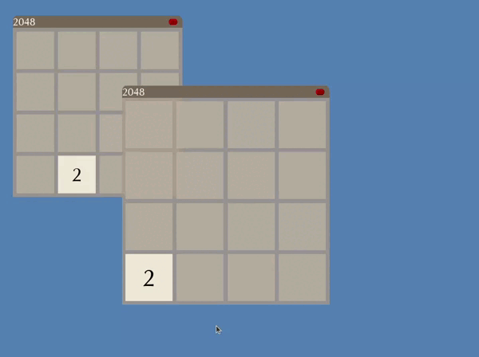
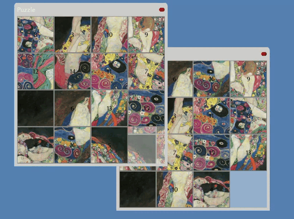

# GUI-Library

[**GUI-Library**](https://github.com/PyroWilDx/GUI-Library/) is a Graphical User Interface (GUI) library designed to efficiently create and manage various widgets.

Below are some examples of applications that can be created using the library.

This project was made in a **Team of 3** as part of the **Project C** course at [Grenoble INP &ndash; Ensimag](https://ensimag.grenoble-inp.fr/).

## Development Set-Up

&nbsp;&nbsp;&nbsp;&nbsp;

&nbsp;&nbsp;&nbsp;&nbsp;

[SDL2](https://www.libsdl.org/)

### How To Use

- Run w/ CLion.

---

  Copyright &#169; 2023 PyroWilDx. All Rights Reserved.

