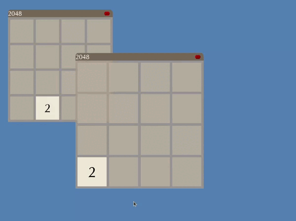
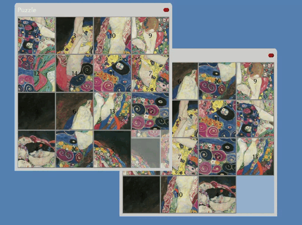

<div align="center">


A GUI library designed to efficiently create and manage various widgets.

</div>

## 🎓 School Project Information

|  |  |
|--|--|
| Team   | 3 |
| Course | Project C |
| School | Grenoble INP - Ensimag |

## ✨ Overview

Below are some examples of applications that can be created using the library.

<div align="center">





</div>

## 🛠️ How To Build

- Build w/ CMake.

```
cmake ..
cmake --build .
```

- Run any test in `./build/*`.

```
./build/minimal
./build/lines
./build/frame
./build/button
./build/hello_world
./build/puzzle
./build/two048
./build/minesweeper
./build/entry
./build/external_class
```

---

<div align="center">
  Copyright &#169; 2023 PyroWilDx. All Rights Reserved.
</div>
